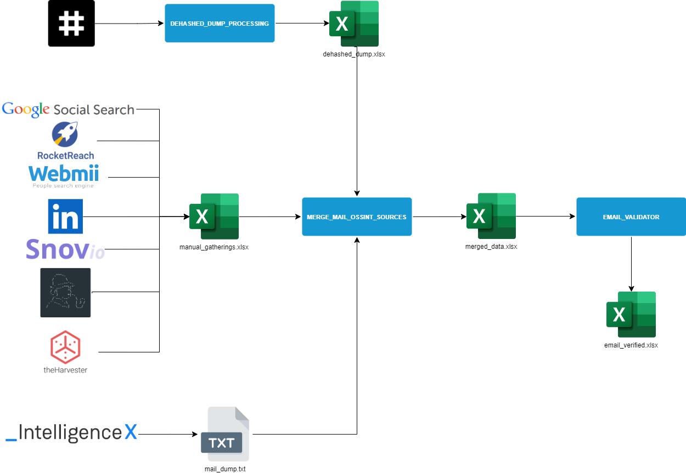

# Motivation
This script is an aid to merge email and employee data collected from different sources into an unique table. It is supposed to be used alongside the data obtained from the ```DEHASHED_DUMP_PROCESSING``` script, [Phonebook.cz](https://phonebook.cz/), and any manual gatherings. The framework is shown below:



# Requeriments
In order for the script to work, two folders need to be created in the root directory of the project:
- ```inputs```: All the input files will go here by default.
- ```outputs```: The output file will be generated here by default.
## Input files
The three input files required for these project are:

| Default name           	| Format     	| Requirements                                                 	|
|------------------------	|------------	|--------------------------------------------------------------	|
| mail_dump.txt          	| text file  	| It must be a text file with one email per line.              	|
| manual_gatherings.xlsx 	| excel book 	| It must contain two columns rotulated as "email" and "name". 	|
| dehashed_dump.xlsx     	| excel book 	| The output of the DEHASHED_DUMP_PROCESSING script.           	|

# Run the script
First, one must install the required dependencies (it is recommended to use a virtual environment) using the command ```pip3 install -r requirements.txt```.
Then, one can run the script using the command ```python3 main.py```.
## Change parameters
One can change the defailt values using the following flags:
- ```-m```: Change the mail list text file.
- ```-g```: Change the manual gatherings file.
- ```-l```:  Change the leaks file.


